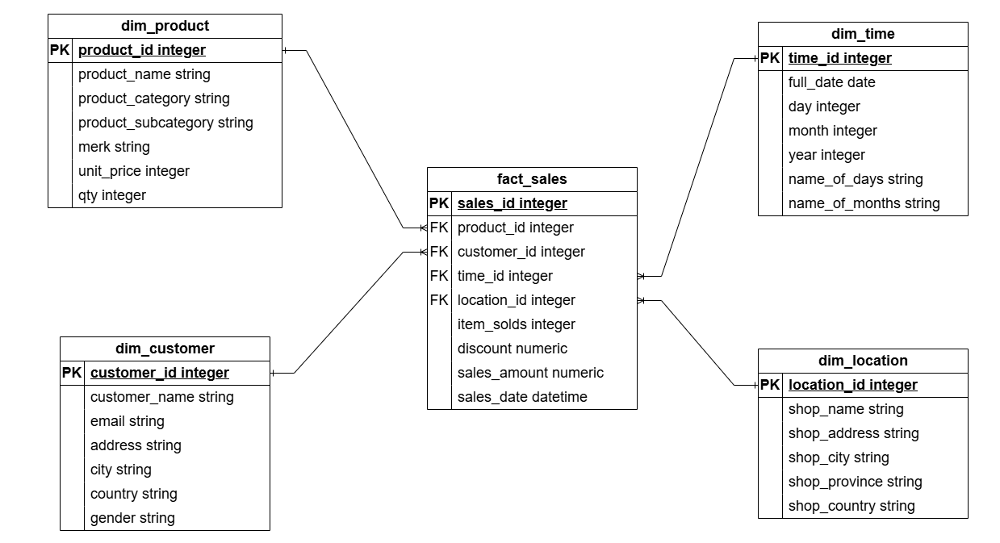

Star Schema is designed to improve performance for aggregations and reporting because dimensions are denormalized that is easy for the memory and make queries simpler.  
As shown in the physical data model below, the design incudes  
a. fact_sales records the quantitative metrics (measurements) that results from a sale. It contains :  
Foreign Keys (FK) : product_id, customer_id, time_id, and location_id which link the fact table to its related dimensions.  
Measures/Metrics : Numerical data used for calculations, such as item_solds, discount, sales_amount, and the event timestamp sales_date.

b. dim_product (What) stores product details including product_name, product_category, product_subcategory, merk (brand), unit price, and qty (quantities).

c. dim_customer (Who) stores customer demographic information such as customer_name, email, address, city, country, and gender.

d. dim_time (When) breaks down dates into several attributes, like day, month, year, name_of_days, and name_of_months to give an easy way to aggregate time-series.

e. dim_location (Where) captures geographic details of the physical or digital store, involving shop_name, shop_address, shop_city, shop_province, and shop_country.

